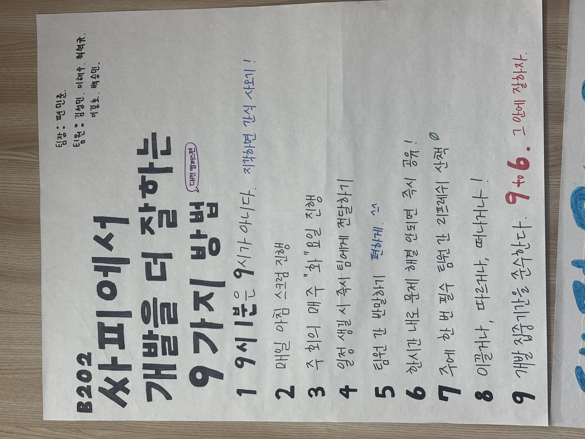
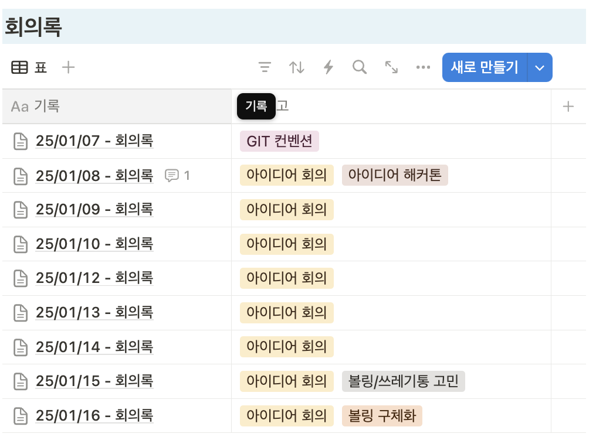

# B202 Team

# 📜  info&Site

[내 작업 - Jira](https://ssafy.atlassian.net/jira/your-work)

</aside>

# 📜  Ground Rule

# 👪  About Us

[편민준](https://www.notion.so/174ffc8046b68058bf70c3d74dd2a320?pvs=21)

[이해수](https://www.notion.so/174ffc8046b6803ea1a9db8496650681?pvs=21)

[김성민](https://www.notion.so/174ffc8046b680a1af91d4b4e712e9c1?pvs=21)

[최혁규](https://www.notion.so/174ffc8046b6808f97edc2625c93e472?pvs=21)

[이길호](https://www.notion.so/174ffc8046b6807894d5df96d652b597?pvs=21)

[백승민](https://www.notion.so/174ffc8046b6807a9716f5807a90f255?pvs=21)

## 자료

[GIT 컨벤션](https://www.notion.so/GIT-ecccaca3c71d4a739fac5ac07e6ec614?pvs=21)

[노션 DB](https://www.notion.so/DB-9ca825514d8f443aa8f947c81cdccf5d?pvs=21)

[프로젝트 평가 안내](https://www.notion.so/57f78048e1ea42fe83acb98684330f25?pvs=21)

[JIRA 사용법 정리](https://www.notion.so/JIRA-17affc8046b681a8982adbf76ee58514?pvs=21)

[프로그레시브 pwa](https://www.notion.so/pwa-17dffc8046b680229c89d4703b488b19?pvs=21)

## 아이디어 피드백

[25/01/09 - iot web](https://www.notion.so/25-01-09-iot-web-176ffc8046b680599dd8f4ebde0ff2a1?pvs=21)

[01/10-아이디어 기획 피드백](https://www.notion.so/01-10-177ffc8046b680b39942d564b69a889b?pvs=21)

[25/01/13 - 피드백](https://www.notion.so/25-01-13-17affc8046b680efb38add90841c240f?pvs=21)

[01/14 - 좁힌 2개 피드백](https://www.notion.so/01-14-2-17bffc8046b680ea8118da184e23a498?pvs=21)

[01/15 마스코트 피드백](https://www.notion.so/01-15-127f71d476b140a99cf7b47aa20639d8?pvs=21)

[01/16 볼링 피드백.. ](https://www.notion.so/01-16-9281b5ebcfb543bca4a54bffda865c68?pvs=21)

## 아이디어 4개 추출화

[아이디어](https://www.notion.so/179ffc8046b680f8b748e065ad4c97a0?pvs=21)

## 아이디어 2개로 추출화

## 스크럼 & 정기회의 
일주일 간격으로 스크럼 마스터를 선정해 매일 아침 10:00에 스크럼을 진행했습니다.
아이디어 기획기간 중 번이 10번의 스크럼 및 회의가 진행되었고, 스크럼에서는 팀원들이 각자의 진행 상황을 공유하고 발생한 이슈들을 함께 논의하여 프로젝트를 원활하게 진행할 수 있었습니다.
또한 프로젝트의 성공적인 완수를 위해 초기 단계에서 체계적인 기획 과정을 거쳤으며, 이를 통해 팀원들의 다양한 아이디어를 수렴하고 프로젝트의 방향성을 명확히 설정할 수 있었습니다.

---

