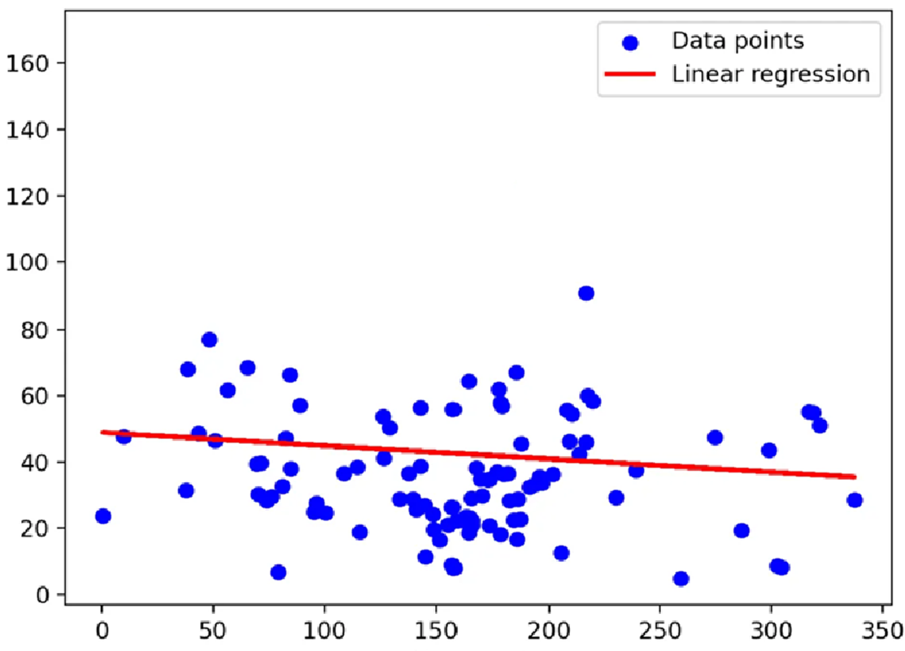

# 🎳B202 - Split(Smart Bowling Coach)
## 📋Project Overview

스마트 볼링 코치 시스템을 통한 효율적인 자세 교정 및 실력 향상 솔루션
[설계](https://www.miricanvas.com/v/1479h8x) | [최종 발표](docs/pdf/SPlit_최종발표.pdf)

## :bowling: 기능

1. 투구 자세 측정 및 평가
   1. 영상을 통한 자세 평가
   2. 아대를 통한 자세 평가
2. 점수 시각화 & 피드백
3. Ranking 시스템

## :gift_heart: 기대효과

**1. :thumbsup: 편의성**
사용자가 자신의 자세를 손쉽게 측정하고 피드백 받을 수 있다.

**2. :pray: 호환성**
   기존 볼링 시스템에 호환되도록 하드웨어를 구성하여 설치 비용을 절감

**3. :laughing: 재미**
   데이터 기반 실력 향상, 랭킹 시스템을 이용한 경쟁 요소로 볼링에 대한 흥미 유발

## 개발 요소

### 아대
- 팔의 요소를 측정 및 사용자 입력 인터페이스
- 사용자의 투구를 방해하지 않기 위해 경량화를 핵심으로 설계
<table>
<tr>
   <th>부품</th>
   <th>설명</th>
</tr>
<tr>
   <td>ESP32</td>
   <td>센서 데이터 처리 및 출력 제어</td>
</tr>
<tr>
   <td>MPU6050 센서</td>
   <td>자이로/가속도 센서 2개를 이용하여 팔의 각도 및 팔 안정성 점수 측정</td>
</tr>
<tr>
   <td>LED</td>
   <td>평가 점수에 대한 대략적인 정보 제공</td>
</tr>
<tr>
   <td>터치 센서</td>
   <td>측정 시작 및 측정 완료에 대한 입력</td>
</tr>
<tr>
   <td>wifi 모듈</td>
   <td>메인 디바이스와 소켓 통신 수행</td>
</tr>
</table>

### 메인 디바이스
- 사용자의 후면을 촬영하여 볼링 점수를 추출하는 메인 디바이스
- 아대 점수와 관절 정보를 종합하여 최종 점수 및 피드백 산출
<table>
<tr>
   <th>부품</th>
   <th>설명</th>
</tr>
<tr>
   <td>Jetson orin nano</td>
   <td>메인 컴퓨팅 기기, 온디바이스 AI로 영상을 기반으로 사용자 자세 평가 수행</td>
</tr>
<tr>
   <td>카메라</td>
   <td>사용자 후면에서 투구 자세 촬영</td>
</tr>
</table> 

### 모바일 웹
- PWA
- Next.js + Android Studio

## :cop: 측정 및 평가
### :camera: AI를 통한 평가

LSTM + CNN

- 평가 결과

### :raised_hand: 아대를 통한 평가

- 제작 하드웨어
 

 
- 회로도1
 

 
- 회로도2
 

## 기술 스택
### platforms & languages
      
     
    
       

### tools
    

## 사진
### 아키텍처

### 학습 데이터셋 구축

### 회귀분석

### 모델 학습 결과

## 🔗 Links & Resources
- [Repository](https://lab.ssafy.com/s12-webmobile3-sub1/S12P11B202)
- [Jira Board](https://ssafy.atlassian.net/jira/your-work)

## 🤝 Ground Rules

## 👥 Team Members
| Profile | Role | Position |
|---------|------|-----------|
| [편민준](https://www.notion.so/174ffc8046b68058bf70c3d74dd2a320) | Team Leader | BE Infra |
| [이해수](https://www.notion.so/174ffc8046b6803ea1a9db8496650681) | Developer | AI | 
| [김성민](https://www.notion.so/174ffc8046b680a1af91d4b4e712e9c1) | Developer | BE Infra |
| [최혁규](https://www.notion.so/174ffc8046b6808f97edc2625c93e472) | Developer | FE IoT |
| [이길호](https://www.notion.so/174ffc8046b6807894d5df96d652b597) | Developer | FE IoT |
| [백승민](https://www.notion.so/174ffc8046b6807a9716f5807a90f255) | Developer | AI |

## 📚 Documentation
### Development Guidelines
- [Git Convention](https://www.notion.so/GIT-ecccaca3c71d4a739fac5ac07e6ec614)
- [Database Schema](https://www.notion.so/DB-9ca825514d8f443aa8f947c81cdccf5d)
- [Project Evaluation Guide](https://www.notion.so/57f78048e1ea42fe83acb98684330f25)
- [Jira Usage Guide](https://www.notion.so/JIRA-17affc8046b681a8982adbf76ee58514)
- [PWA Implementation](https://www.notion.so/pwa-17dffc8046b680229c89d4703b488b19)

#### Ideation Process
체계적인 아이디어 발굴 및 구체화 과정:
1. [초기 아이디어 구상](https://www.notion.so/179ffc8046b680f8b748e065ad4c97a0)
2. [아이디어 구체화](https://www.notion.so/17bffc8046b68038a0f5e2afcb7b5022)
3. [피드백 세션](#피드백-기록)

### 피드백 기록
- [01/09 - IoT Web 기획](https://www.notion.so/25-01-09-iot-web-176ffc8046b680599dd8f4ebde0ff2a1)
- [01/10 - 아이디어 기획](https://www.notion.so/01-10-177ffc8046b680b39942d564b69a889b)
- [01/13 - 중간 점검](https://www.notion.so/25-01-13-17affc8046b680efb38add90841c240f)
- [01/14 - 아이디어 선별](https://www.notion.so/01-14-2-17bffc8046b680ea8118da184e23a498)
- [01/15 - 마스코트 디자인](https://www.notion.so/01-15-127f71d476b140a99cf7b47aa20639d8)
- [01/16 - 볼링 시스템](https://www.notion.so/01-16-9281b5ebcfb543bca4a54bffda865c68)

### Project Development Process
#### Scrum Management
일주일 간격으로 스크럼 마스터를 선정해 매일 아침 10:00에 스크럼을 진행했습니다.
아이디어 기획기간 중 번이 10번의 스크럼 및 회의가 진행되었고, 스크럼에서는 팀원들이 각자의 진행 상황을 공유하고 발생한 이슈들을 함께 논의하여 프로젝트를 원활하게 진행할 수 있었습니다.
또한 프로젝트의 성공적인 완수를 위해 초기 단계에서 체계적인 기획 과정을 거쳤으며, 이를 통해 팀원들의 다양한 아이디어를 수렴하고 프로젝트의 방향성을 명확히 설정할 수 있었습니다.

